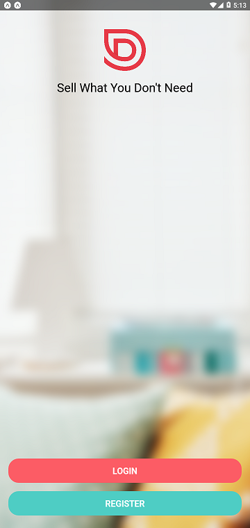
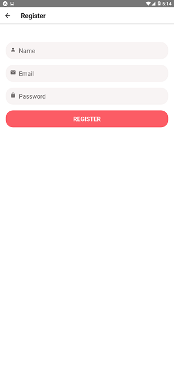
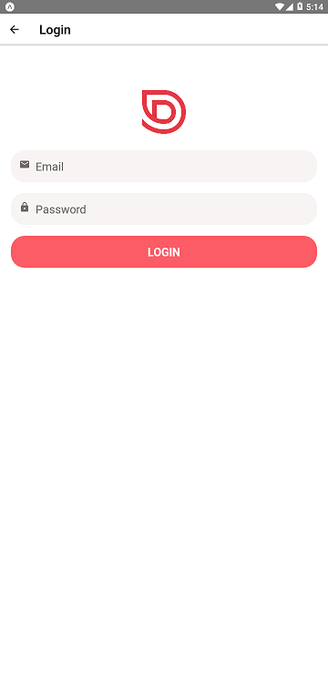
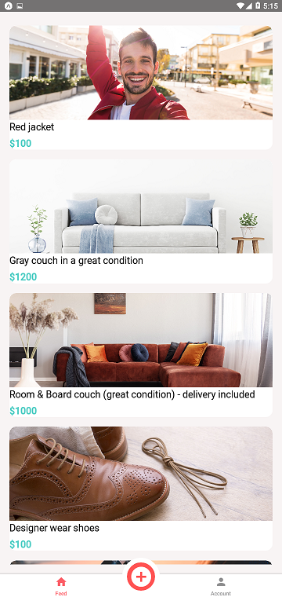
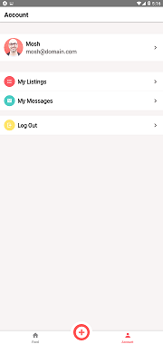
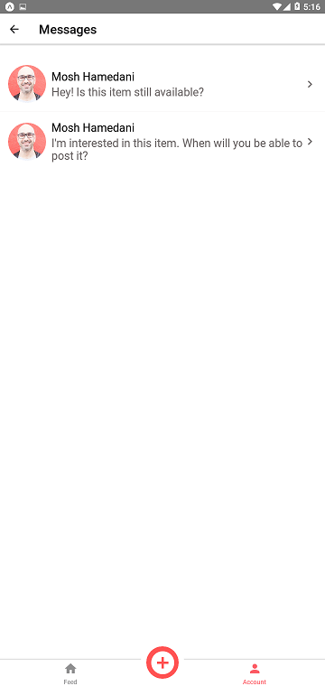

# DoneWithItCWMrn

Project From Code With Mosh's React Native Course.
Part One, Part Two app source code as well as backend source code.

Topics learned:

- Layout
- Styling
- Flatlist
- Input Components
- Forms
- Native Features
- Navigation
- Networking
- Offline Support
- Authentication
- Notification
- Distribution

###Screenshots:

