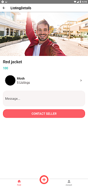
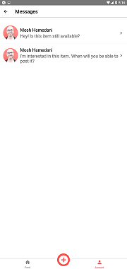

# DoneWithItCWMrn

Project From Code With Mosh's React Native Course.
Part One, Part Two app source code as well as backend source code.

Topics learned:

- Layout
- Styling
- Flatlist
- Input Components
- Forms
- Native Features
- Navigation
- Networking
- Offline Support
- Authentication
- Notification
- Distribution

# Screenshots:

| Login Register Screen                                | Register Screen                                  |
| ---------------------------------------------------- | ------------------------------------------------ |
|  |  |

| Login Screen                               | List Screens                             |
| ------------------------------------------ | ---------------------------------------- |
|  |  |

| Details Screen                                | Account Screen                                 |
| --------------------------------------------- | ---------------------------------------------- |
|  |  |

| Messeges Screen                                  |
| ------------------------------------------------ |
|  |
